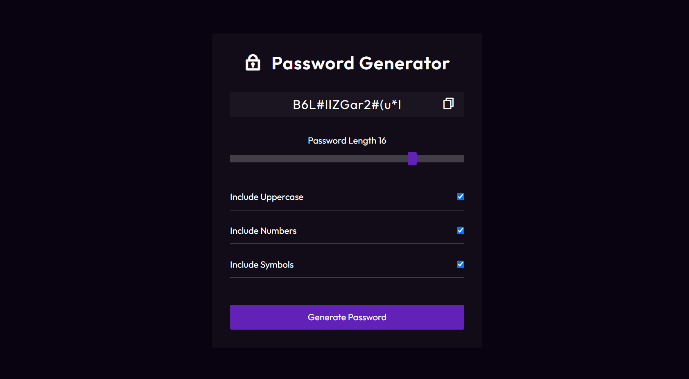

# Password Generator

Welcome to the Password Generator repository! This project is a JavaScript-based web application designed to generate secure passwords with customizable options. Built with HTML, CSS, and JavaScript, it features a modern UI design for an intuitive and user-friendly experience.

## Preview



## Features

- **Customizable Passwords:** Generate passwords with options for uppercase letters, symbols, and numbers.
- **Modern UI Design:** Sleek layout and visually appealing design for an enjoyable user interface.
- **Easy-to-Use:** Simple and straightforward interface for quick password generation.

## Getting Started

To run the Password Generator locally, follow these steps:

1. Clone the repository to your local machine:

   ```bash
   git clone https://github.com/Devsethi3/Password-Generator.git
   ```

2. Open the `index.html` file in your preferred web browser.

## Usage

1. Select the desired options for your password (Uppercase, Symbols, Numbers).
2. Set the length of your password using the slider.
3. Click the "Generate Password" button to generate a secure password.
4. Copy the generated password to your clipboard using the "Copy to Clipboard" button.

## Customization

Feel free to customize this project to fit your preferences. Update styles, colors, and layout in the HTML and CSS files. You can also extend the functionality to include additional features or customization options.

## Contributing

If you'd like to contribute to this project, please follow these steps:

1. Fork the repository.
2. Create a new branch for your feature or improvement.
3. Make your changes and commit them with descriptive messages.
4. Push your changes to your forked repository.
5. Open a pull request to merge your changes into the main branch.

Explore the Password Generator, create secure passwords effortlessly, and consider contributing to its development. Thank you for checking out the repository!